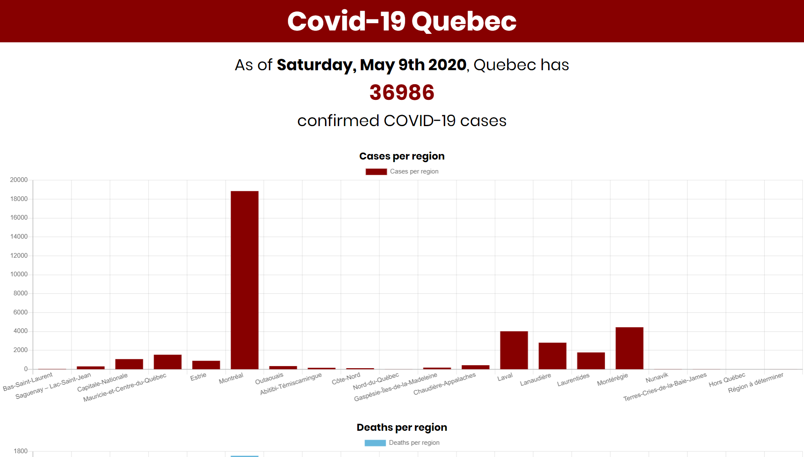
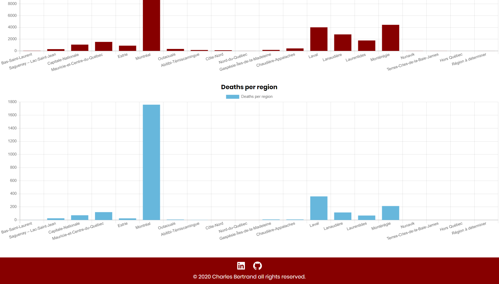

# Covid-19 Quebec

Simple application where you can see the number of Covid-19 cases in Quebec. There's also charts with the number of cases and deaths per region.

## TECH STACK

- React
- NodeJS and express
- Chart JS
- Cheerio

## RUN LOCALLY

clone using https://github.com/Charles9869/COVID19-Quebec.git

## SCREENSHOTS

### First Chart

### Second Chart

